2026 Q1
=======

========
Overview
========

The 2026 Q1 report includes the following benchmarks:

   **Persistent Contrail Regions: Hit Rate vs Flight Distance** (`methods <#>`_)

   Forecasts: `Contrails.org`_, `Google`_ (`examples <../../forecasts.rst>`__)

   Evaluation Datasets: `ContrailWatch`_, `GRUAN`_, `IAGOS`_ (`examples <../../datasets.rst>`__)

   Time Periods: 2024 (full year and seasons)

   Regions: Global (GRUAN and IAGOS only), CONUS (all observations)

   Notes: ContrailWatch observations were available for CONUS only at the time this report
   was generated and are omitted from global benchmarks. CONUS benchmarks include the region
   from 134W-63W and 20N-50N.

========================================================
Persistent Contrail Regions: Hit Rate vs Flight Distance
========================================================

Global, January-December 2024
-----------------------------

|

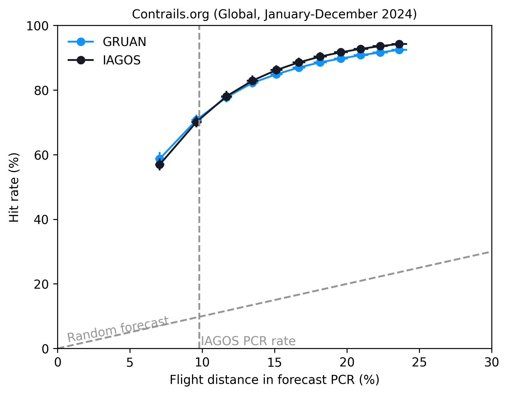

   Download
   `data <https://storage.googleapis.com/contrailbench-public-data/2026Q1/benchmarks/global-contrails-org.pq>`__,
   `confidence intervals <https://storage.googleapis.com/contrailbench-public-data/2026Q1/benchmarks/global-contrails-org-ci.pq>`__

|

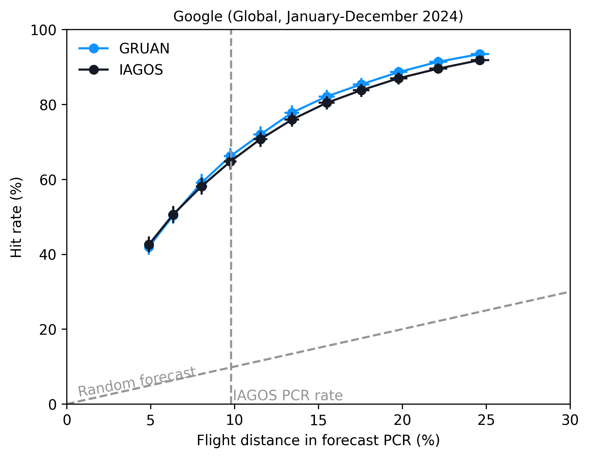

   Download
   `data <https://storage.googleapis.com/contrailbench-public-data/2026Q1/benchmarks/global-google.pq>`__,
   `confidence intervals <https://storage.googleapis.com/contrailbench-public-data/2026Q1/benchmarks/global-google-ci.pq>`__

|

Global, January/February/December 2024 (NH winter)
--------------------------------------------------

|

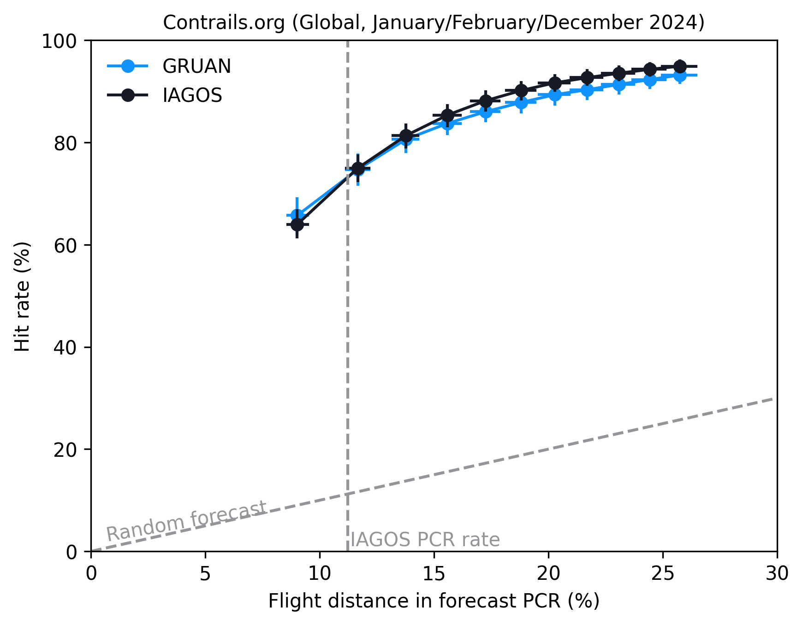

   Download
   `data <https://storage.googleapis.com/contrailbench-public-data/2026Q1/benchmarks/global-winter-contrails-org.pq>`__,
   `confidence intervals <https://storage.googleapis.com/contrailbench-public-data/2026Q1/benchmarks/global-winter-contrails-org-ci.pq>`__

|

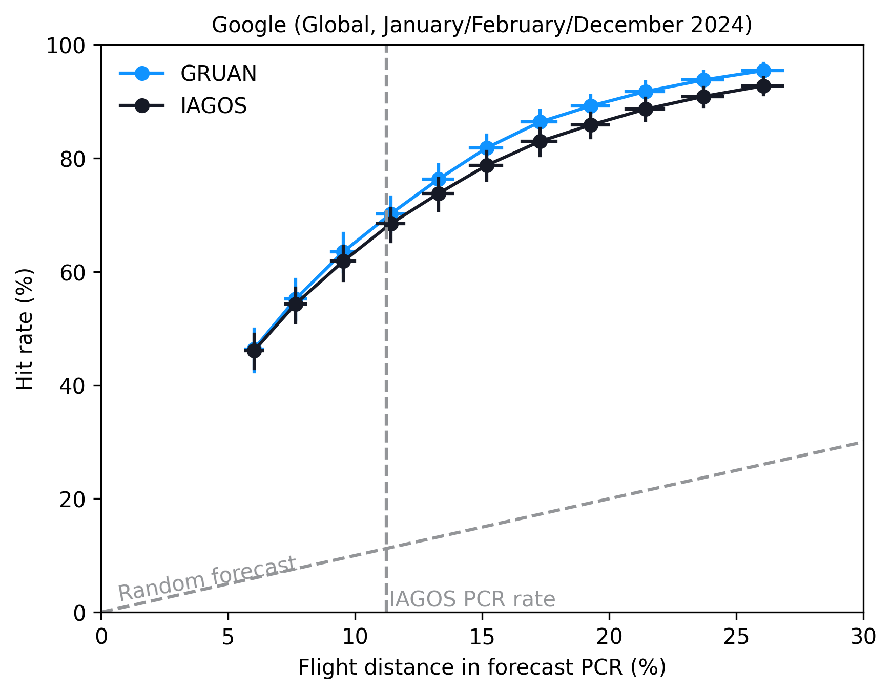

   Download
   `data <https://storage.googleapis.com/contrailbench-public-data/2026Q1/benchmarks/global-winter-google.pq>`__,
   `confidence intervals <https://storage.googleapis.com/contrailbench-public-data/2026Q1/benchmarks/global-winter-google-ci.pq>`__

|

Global, March-May 2024 (NH spring)
----------------------------------

|

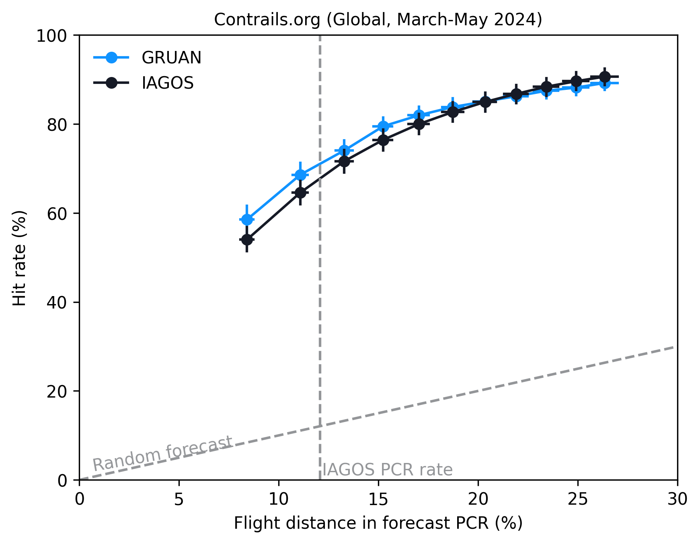

   Download
   `data <https://storage.googleapis.com/contrailbench-public-data/2026Q1/benchmarks/global-spring-contrails-org.pq>`__,
   `confidence intervals <https://storage.googleapis.com/contrailbench-public-data/2026Q1/benchmarks/global-spring-contrails-org-ci.pq>`__

|

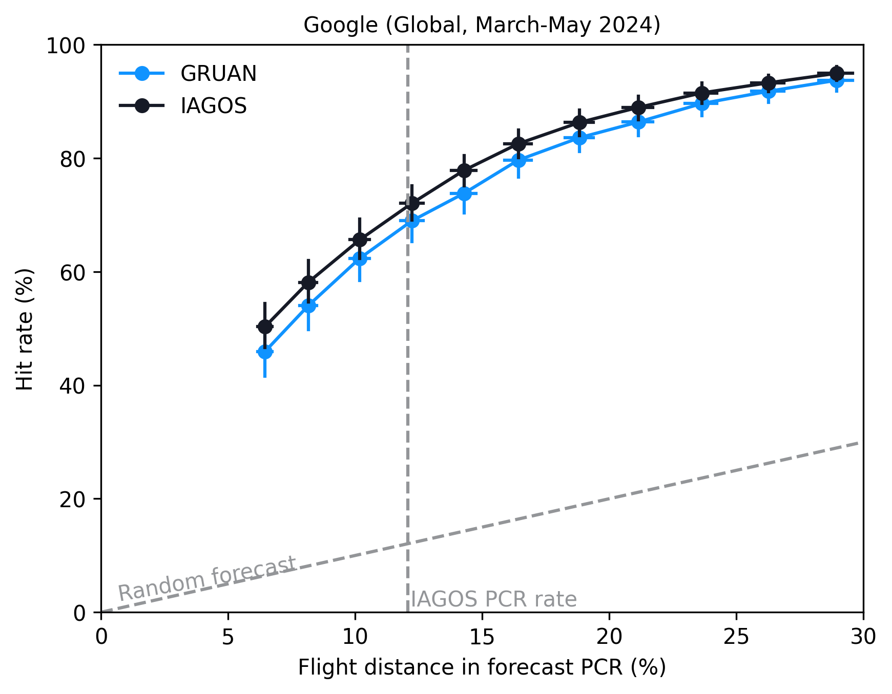

   Download
   `data <https://storage.googleapis.com/contrailbench-public-data/2026Q1/benchmarks/global-spring-google.pq>`__,
   `confidence intervals <https://storage.googleapis.com/contrailbench-public-data/2026Q1/benchmarks/global-spring-google-ci.pq>`__

|

Global, June-August 2024 (NH summer)
------------------------------------

|

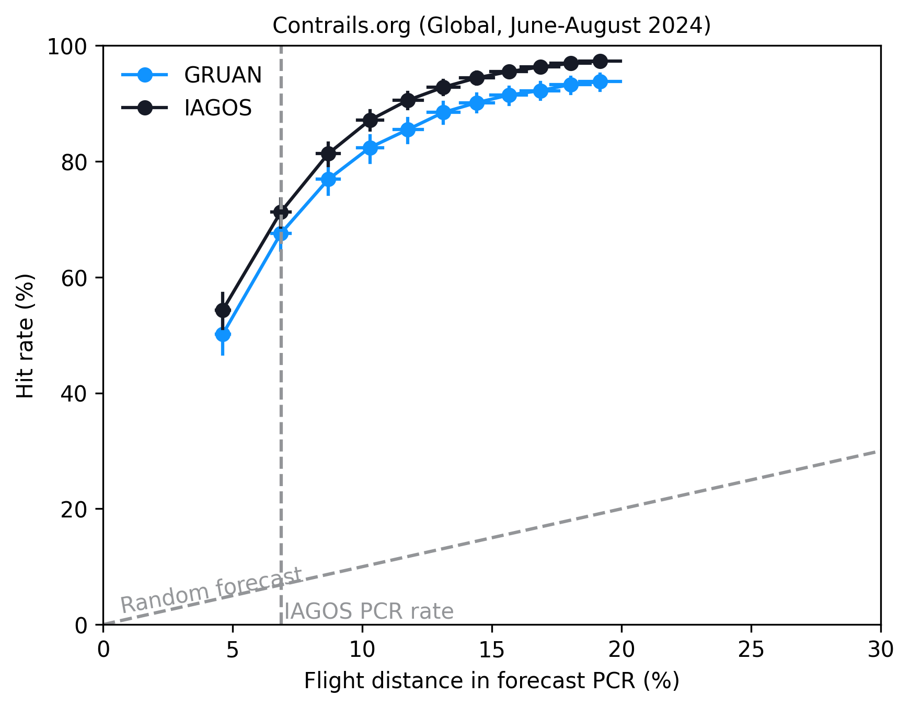

   Download
   `data <https://storage.googleapis.com/contrailbench-public-data/2026Q1/benchmarks/global-summer-contrails-org.pq>`__,
   `confidence intervals <https://storage.googleapis.com/contrailbench-public-data/2026Q1/benchmarks/global-summer-contrails-org-ci.pq>`__

|

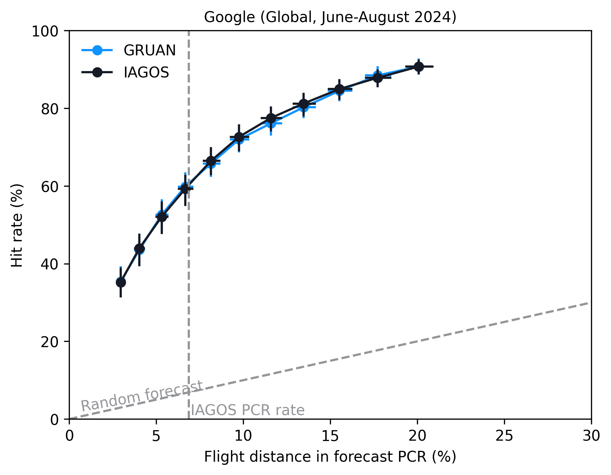

   Download
   `data <https://storage.googleapis.com/contrailbench-public-data/2026Q1/benchmarks/global-summer-google.pq>`__,
   `confidence intervals <https://storage.googleapis.com/contrailbench-public-data/2026Q1/benchmarks/global-summer-google-ci.pq>`__

|

Global, September-November 2024 (NH autumn)
-------------------------------------------

|

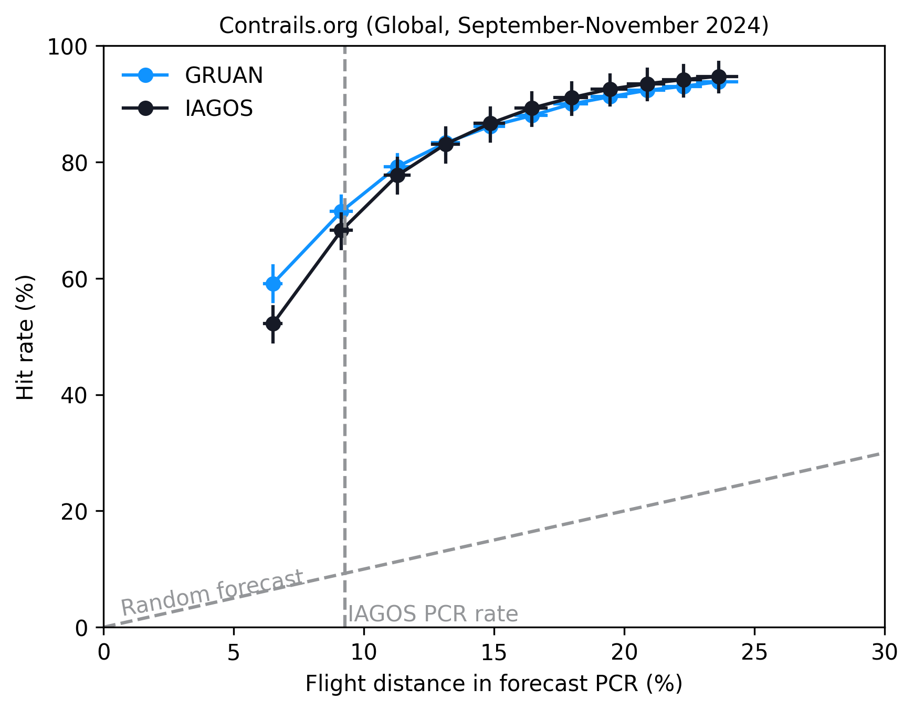

   Download
   `data <https://storage.googleapis.com/contrailbench-public-data/2026Q1/benchmarks/global-autumn-contrails-org.pq>`__,
   `confidence intervals <https://storage.googleapis.com/contrailbench-public-data/2026Q1/benchmarks/global-autumn-contrails-org-ci.pq>`__

|

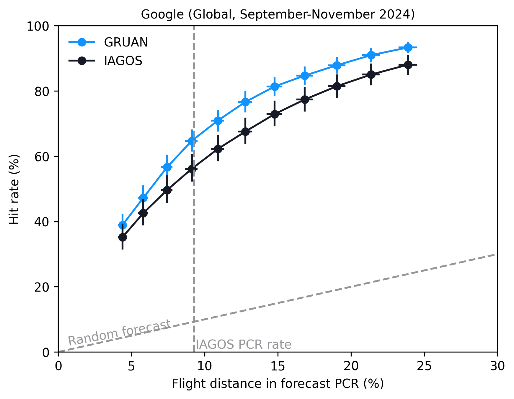

   Download
   `data <https://storage.googleapis.com/contrailbench-public-data/2026Q1/benchmarks/global-autumn-google.pq>`__,
   `confidence intervals <https://storage.googleapis.com/contrailbench-public-data/2026Q1/benchmarks/global-autumn-google-ci.pq>`__

|

CONUS, January-December 2024
----------------------------

|

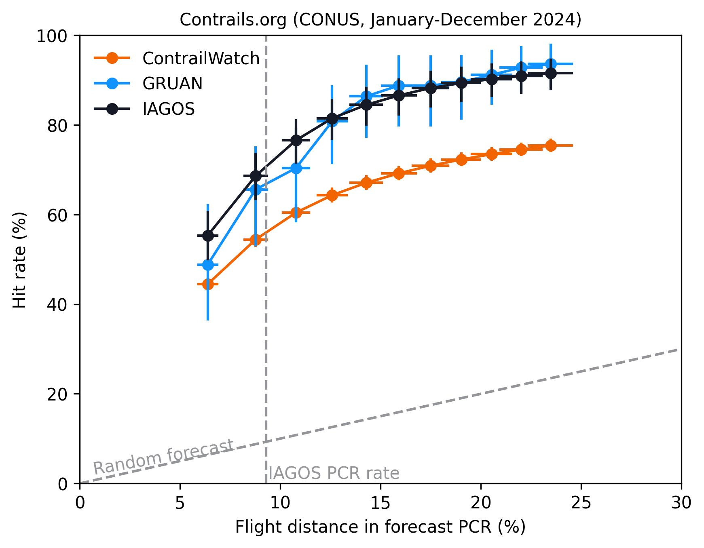

   Download
   `data <https://storage.googleapis.com/contrailbench-public-data/2026Q1/benchmarks/conus-contrails-org.pq>`__,
   `confidence intervals <https://storage.googleapis.com/contrailbench-public-data/2026Q1/benchmarks/conus-contrails-org-ci.pq>`__

|

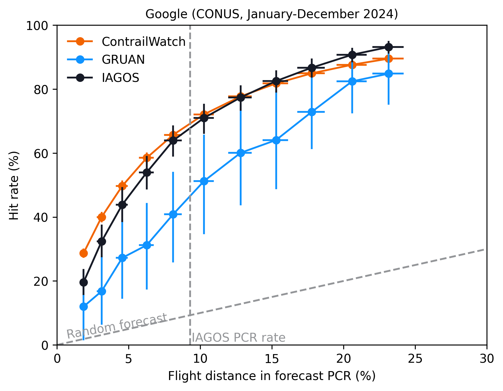

   Download
   `data <https://storage.googleapis.com/contrailbench-public-data/2026Q1/benchmarks/conus-google.pq>`__,
   `confidence intervals <https://storage.googleapis.com/contrailbench-public-data/2026Q1/benchmarks/conus-google-ci.pq>`__

.. _Contrails.org: https://apidocs.contrails.org/notebooks/forecast_api.html
.. _Google: https://developers.google.com/contrails/v1/forecast-description#ml-based_model

.. _GRUAN: https://www.gruan.org/
.. _IAGOS: https://www.iagos.org/
.. _ContrailWatch: https://developers.google.com/contrails/v1/ContrailWatch-description
